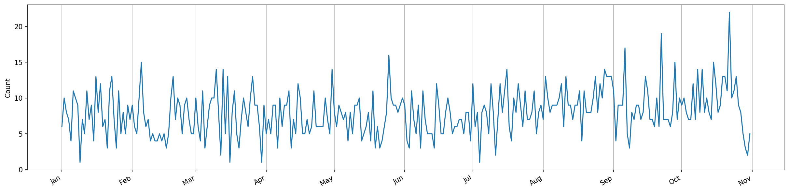

# Crime Around John: A look into crime incidents in Portland, Oregon for 2021

The motivation for this analysis is partly to understand crime occurence around my friend John's house but mostly to have him think it is inherently dangerous so he will be motivated to move back closer to me. Let's get into it!


```python
from helper_functions import *

import pandas as pd
pd.options.mode.chained_assignment = None  # default='warn'
import numpy as np
import matplotlib.pyplot as plt
import datetime as dt
import matplotlib.dates as mdates
import geopandas as gpd
plt.rcParams['figure.dpi'] = 150
plt.rcParams["figure.figsize"] = (20,5)
```

First, I downloaded the data from [here](https://www.portlandoregon.gov/police/71978). I downloaded the data for all of Portland in 2021 only. They update the data monthly so as of writing this, the date range is January 1, 2021 to November 30, 2021.


```python
df = pd.read_csv("2021_Portland-Crime-Data.csv", converters={"OccurTime": str})
df.head()
```


<div>
<style scoped>
    .dataframe tbody tr th:only-of-type {
        vertical-align: middle;
    }

    .dataframe tbody tr th {
        vertical-align: top;
    }

    .dataframe thead th {
        text-align: right;
    }
</style>
<table border="1" class="dataframe">
  <thead>
    <tr style="text-align: right;">
      <th></th>
      <th>Address</th>
      <th>CaseNumber</th>
      <th>CrimeAgainst</th>
      <th>Neighborhood</th>
      <th>OccurDate</th>
      <th>OccurTime</th>
      <th>OffenseCategory</th>
      <th>OffenseType</th>
      <th>OpenDataLat</th>
      <th>OpenDataLon</th>
      <th>ReportDate</th>
      <th>OffenseCount</th>
    </tr>
  </thead>
  <tbody>
    <tr>
      <th>0</th>
      <td>NaN</td>
      <td>21-X5543818</td>
      <td>Person</td>
      <td>Concordia</td>
      <td>12/31/2020</td>
      <td>1230</td>
      <td>Assault Offenses</td>
      <td>Aggravated Assault</td>
      <td>NaN</td>
      <td>NaN</td>
      <td>1/1/2021</td>
      <td>1</td>
    </tr>
    <tr>
      <th>1</th>
      <td>NaN</td>
      <td>21-X5543818</td>
      <td>Property</td>
      <td>Concordia</td>
      <td>12/31/2020</td>
      <td>1230</td>
      <td>Larceny Offenses</td>
      <td>All Other Larceny</td>
      <td>NaN</td>
      <td>NaN</td>
      <td>1/1/2021</td>
      <td>1</td>
    </tr>
    <tr>
      <th>2</th>
      <td>NaN</td>
      <td>21-X5543827</td>
      <td>Person</td>
      <td>Pearl</td>
      <td>1/1/2021</td>
      <td>0715</td>
      <td>Assault Offenses</td>
      <td>Simple Assault</td>
      <td>NaN</td>
      <td>NaN</td>
      <td>1/1/2021</td>
      <td>1</td>
    </tr>
    <tr>
      <th>3</th>
      <td>NaN</td>
      <td>21-X5543859</td>
      <td>Person</td>
      <td>Centennial</td>
      <td>1/1/2021</td>
      <td>2013</td>
      <td>Assault Offenses</td>
      <td>Aggravated Assault</td>
      <td>NaN</td>
      <td>NaN</td>
      <td>1/1/2021</td>
      <td>1</td>
    </tr>
    <tr>
      <th>4</th>
      <td>NaN</td>
      <td>21-X5543864</td>
      <td>Person</td>
      <td>Powellhurst-Gilbert</td>
      <td>1/1/2021</td>
      <td>0816</td>
      <td>Assault Offenses</td>
      <td>Simple Assault</td>
      <td>NaN</td>
      <td>NaN</td>
      <td>1/1/2021</td>
      <td>1</td>
    </tr>
  </tbody>
</table>
</div>


To clean the data, I filtered out far away neighborhoods from John to leave only key neighborhoods surrounding his dwelling. I also converted the date from the standard M/D/Y format and the time from the standard HHMM format to one single DateTime. Finally, I filtered out crimes with occur dates outside of 2021. Crimes that are *reported* in 2021 make it into this data even if the date they *occured* is not in 2021.


```python
clean_df = df[df["Neighborhood"].isin(["University Park", "Portsmouth", "St Johns", "Cathedral Park", "Kenton"])]

clean_df["OccurDateTime"] = pd.to_datetime(df["OccurDate"] + df["OccurTime"], format="%m/%d/%Y%H%M")
clean_df["OccurDateTime"] = clean_df["OccurDateTime"].dt.tz_localize('America/Los_Angeles')

clean_df = clean_df[pd.DatetimeIndex(clean_df['OccurDateTime']).year == 2021]

clean_df.head()
```


<div>
<style scoped>
    .dataframe tbody tr th:only-of-type {
        vertical-align: middle;
    }

    .dataframe tbody tr th {
        vertical-align: top;
    }

    .dataframe thead th {
        text-align: right;
    }
</style>
<table border="1" class="dataframe">
  <thead>
    <tr style="text-align: right;">
      <th></th>
      <th>Address</th>
      <th>CaseNumber</th>
      <th>CrimeAgainst</th>
      <th>Neighborhood</th>
      <th>OccurDate</th>
      <th>OccurTime</th>
      <th>OffenseCategory</th>
      <th>OffenseType</th>
      <th>OpenDataLat</th>
      <th>OpenDataLon</th>
      <th>ReportDate</th>
      <th>OffenseCount</th>
      <th>OccurDateTime</th>
    </tr>
  </thead>
  <tbody>
    <tr>
      <th>40</th>
      <td>NaN</td>
      <td>21-X5545334</td>
      <td>Person</td>
      <td>Kenton</td>
      <td>1/3/2021</td>
      <td>0500</td>
      <td>Assault Offenses</td>
      <td>Simple Assault</td>
      <td>NaN</td>
      <td>NaN</td>
      <td>1/6/2021</td>
      <td>1</td>
      <td>2021-01-03 05:00:00-08:00</td>
    </tr>
    <tr>
      <th>51</th>
      <td>NaN</td>
      <td>21-X5545472</td>
      <td>Person</td>
      <td>Portsmouth</td>
      <td>1/7/2021</td>
      <td>1502</td>
      <td>Assault Offenses</td>
      <td>Aggravated Assault</td>
      <td>NaN</td>
      <td>NaN</td>
      <td>1/7/2021</td>
      <td>1</td>
      <td>2021-01-07 15:02:00-08:00</td>
    </tr>
    <tr>
      <th>113</th>
      <td>NaN</td>
      <td>21-X5547170</td>
      <td>Person</td>
      <td>Portsmouth</td>
      <td>1/12/2021</td>
      <td>1730</td>
      <td>Assault Offenses</td>
      <td>Aggravated Assault</td>
      <td>NaN</td>
      <td>NaN</td>
      <td>1/12/2021</td>
      <td>1</td>
      <td>2021-01-12 17:30:00-08:00</td>
    </tr>
    <tr>
      <th>120</th>
      <td>NaN</td>
      <td>21-X5547427</td>
      <td>Property</td>
      <td>Cathedral Park</td>
      <td>1/13/2021</td>
      <td>1243</td>
      <td>Larceny Offenses</td>
      <td>Theft From Motor Vehicle</td>
      <td>NaN</td>
      <td>NaN</td>
      <td>1/13/2021</td>
      <td>1</td>
      <td>2021-01-13 12:43:00-08:00</td>
    </tr>
    <tr>
      <th>124</th>
      <td>NaN</td>
      <td>21-X5547496</td>
      <td>Person</td>
      <td>St Johns</td>
      <td>1/13/2021</td>
      <td>2126</td>
      <td>Assault Offenses</td>
      <td>Simple Assault</td>
      <td>NaN</td>
      <td>NaN</td>
      <td>1/13/2021</td>
      <td>1</td>
      <td>2021-01-13 21:26:00-08:00</td>
    </tr>
  </tbody>
</table>
</div>


## Cleaning operations:  

- filtered to only neighborhoods around John:  
  1. University Park
  2. Portsmouth
  3. St. John's
  4. Cathedral Park
  5. Kenton
- converted date and time of occurrence to a more readable format  
- filtered out occur dates not in 2021

# Now the fun stuff: data analysis!

## What are the most popular crimes around John's house?


```python
lumped_df = lump(clean_df, "OffenseCategory", 15) # defined in helper_functions.py

ax = lumped_df.plot(
  kind='bar', 
  title="Offense Category Frequency",
  ylabel="Count"
  )
ax.set_xticklabels(ax.get_xticklabels(), rotation=40, ha="right")
ax.set_xlabel(None)

plt.show()
```


    

    


The top two crime categories, larceny offenses and motor vehicle theft, occur more than all the rest of the crimes combined! Larceny is [defined by Portland](https://www.portlandoregon.gov/police/article/28509) as

> The unlawful taking of property from the possession of another; includes pickpocket, pursesnatch, shoplift, and bike theft.

### Of the larceny offenses, what is most common?


```python
larceny_df = clean_df[clean_df["OffenseCategory"] == "Larceny Offenses"]

ax = larceny_df["OffenseType"].value_counts().plot(
  kind="bar",
  title="Larceny Offenses Breakdown",
  ylabel="Count"
)
ax.set_xticklabels(ax.get_xticklabels(), rotation=40, ha="right")

plt.show()
```


    

    


There's all those stolen catalytic converters!

## What dates are the most full of crime?


```python
plt.clf()

day_s = clean_df.groupby(pd.DatetimeIndex(clean_df["OccurDateTime"]).date).size()

fig, ax = plt.subplots()
ax = day_s.plot()
ax.xaxis.set_major_formatter(mdates.DateFormatter("%b")) # abbreviated months as x ticks
fig.autofmt_xdate() # rotates label
ax.grid(axis="x") # adds major gridlines on x only
ax.set_ylabel("Count")

plt.show()
```


    <Figure size 3000x750 with 0 Axes>


    

    


Let's take a gander at the day with the most crime: October 22, 2021.


```python
day_s[day_s == max(day_s)]

max_crime_day_df = clean_df.loc[pd.DatetimeIndex(clean_df["OccurDateTime"]).date == day_s[day_s==max(day_s)].index[0], :]

ax = max_crime_day_df['OffenseCategory'].value_counts().plot(
    kind='bar',
    title="Offense Category Frequency on October 22, 2021",
    ylabel="Count"
  )

ax.set_xticklabels(ax.get_xticklabels(), rotation=40, ha="right")

plt.show()
```


    

    


## Mapping


```python
locations_df = clean_df.dropna(subset=["OpenDataLat", "OpenDataLon"])  # drop rows with no location data

projection = 4326  # mapping projection with units in degrees

shape_data = gpd.read_file("Neighborhoods_(Regions)/Neighborhoods_(Regions).shp").to_crs(epsg=projection)
shape_data = shape_data[shape_data["NAME"].isin(["UNIVERSITY PARK", "PORTSMOUTH", "ST. JOHNS", "CATHEDRAL PARK", "KENTON"])]

gdf = gpd.GeoDataFrame(locations_df, geometry=gpd.points_from_xy(locations_df.OpenDataLon, locations_df.OpenDataLat, crs="EPSG:"+str(projection)))

poi_df = pd.DataFrame({"Longitude": [-122.738492], "Latitude": [45.589969]})  # Roosevelt High School coords
poi_gdf = gpd.GeoDataFrame(poi_df, geometry=gpd.points_from_xy(poi_df.Longitude, poi_df.Latitude, crs="EPSG:"+str(projection)))

# change projections and calculation distance
projection = 3857  # projection with units in meters
gdf.to_crs(crs=projection, inplace=True)
poi_gdf.to_crs(crs=projection, inplace=True)
gdf["distance_from_poi_m"] = gdf.geometry.distance(poi_gdf.geometry[0])
gdf["distance_from_poi_mi"] = gdf.distance_from_poi_m/1609

# change projections back for mapping
projection = 4326

gdf.to_crs(crs=projection, inplace=True)
poi_gdf.to_crs(crs=projection, inplace=True)

f, (ax1, ax2) = plt.subplots(1, 2)
ax1 = shape_data.plot(color="black", alpha=0.4, edgecolor="black", ax=ax1)
ax1 = gdf.plot(ax=ax1, markersize=2, c=gdf["distance_from_poi_m"])  # gdf.explore() for interactive map
ax1 = poi_gdf.plot(ax=ax1, marker="*", markersize=80, color="yellow")
ax1.xaxis.set_visible(False)
ax1.yaxis.set_visible(False)

ax2 = gdf.distance_from_poi_mi.plot(
    kind="hist",
    bins="fd",
    ax=ax2
)

ax2.yaxis.set_label_position("right")
ax2.yaxis.tick_right()
ax2.set_ylabel("Count")
ax2.set_xlabel("Distance From Point of Interest [mi]")
ax2.set_xticks(range(0, round(max(gdf["distance_from_poi_mi"])) + 1));

```


    

    


Most crimes happen 1-2 miles away. The big neighborhood to the Northwest (St. Johns) is mostly a couple of lakes indicated by the big area where there is no crime. Interestingly, the crime occurences map out Marine Drive and Lombard Street along the outside. 

## What time of day does most crime occur?


```python
time_s = clean_df["OccurDateTime"].dt.hour.value_counts()

ax = plt.bar(time_s.index, time_s.values)
```


    

    

