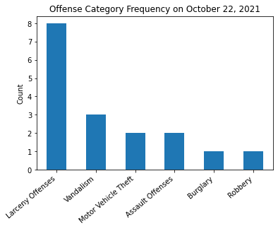

# Crime Around John: A look into crime incidents in Portland, Oregon for 2021


```python
import pandas as pd
pd.options.mode.chained_assignment = None  # default='warn'
import numpy as np
import matplotlib.pyplot as plt
import datetime as dt
import matplotlib.dates as mdates
import geopandas as gpd
```


```python
df = pd.read_csv("2021_Portland-Crime-Data.csv", converters={"OccurTime": str})
```


```python
clean_df = df[df["Neighborhood"].isin(["University Park", "Portsmouth", "St Johns", "Cathedral Park"])]

clean_df["OccurDateTime"] = pd.to_datetime(df["OccurDate"] + df["OccurTime"], format="%m/%d/%Y%H%M")

clean_df["OccurDateTime"] = clean_df["OccurDateTime"].dt.tz_localize('America/Los_Angeles')

clean_df = clean_df[pd.DatetimeIndex(clean_df['OccurDateTime']).year == 2021]
```

### Cleaning operations:  

- changed some column names  
- filtered to only neighborhoods around John:  
  1. University Park  
  2. Portsmouth
  3. St. John's  
  4. Cathedral Park  
- converted date and time of occurrence to a more readable format  
- filtered out dates not in 2021

# Now the fun stuff: data analysis!

## What are the most popular crimes around John's house?
TODO: group lower columns into "Other"


```python
ax = clean_df['OffenseCategory'].value_counts().plot(
  kind='bar', 
  title="Offense Category Frequency", 
  ylabel="Count"
  )
ax.set_xticklabels(ax.get_xticklabels(), rotation=40, ha="right")

plt.show()
```


    

    


The top two crime categories, larceny offenses and motor vehicle theft, occur more than all the rest of the crimes combined! Larceny is [defined by Portland](https://www.portlandoregon.gov/police/article/28509) as

> The unlawful taking of property from the possession of another; includes pickpocket, pursesnatch, shoplift, and bike theft.

### Of the larceny offenses, what is most common?


```python
larceny_df = clean_df[clean_df["OffenseCategory"]=="Larceny Offenses"]

ax = larceny_df["OffenseType"].value_counts().plot(
  kind="bar", 
  title="Larceny Offenses Breakdown",
  ylabel="Count"
)
ax.set_xticklabels(ax.get_xticklabels(), rotation=40, ha="right")

plt.show()
```


    

    


There's all those stolen catalytic converters!

## What dates are the most full of crime?


```python
plt.clf()

day_s = clean_df.groupby(pd.DatetimeIndex(clean_df["OccurDateTime"]).date).size()

fig, ax = plt.subplots()
ax = day_s.plot()
ax.xaxis.set_major_formatter(mdates.DateFormatter("%b")) # abbreviated months as x ticks
fig.autofmt_xdate() # rotates label
ax.grid(axis="x") # adds major gridlines on x only
ax.set_ylabel("Count")

plt.show()
```


    <Figure size 432x288 with 0 Axes>


    

    


Let's take a gander at the day with the most crime, October 22, 2021.


```python
day_s[day_s == max(day_s)]

max_crime_day_df = clean_df.loc[pd.DatetimeIndex(clean_df["OccurDateTime"]).date == day_s[day_s==max(day_s)].index[0], :]

ax = max_crime_day_df['OffenseCategory'].value_counts().plot(
    kind='bar',
    title="Offense Category Frequency on October 22, 2021",
    ylabel="Count"
  )

ax.set_xticklabels(ax.get_xticklabels(), rotation=40, ha="right")

plt.show()
```


    

    


## Mapping


```python
locations_df = clean_df.dropna(subset=["OpenDataLat", "OpenDataLon"]) # drop rows with no location data

projection = 4326

shape_data = gpd.read_file("Neighborhoods_(Regions)/Neighborhoods_(Regions).shp").to_crs(epsg=projection)
shape_data = shape_data[shape_data["NAME"].isin(["UNIVERSITY PARK", "PORTSMOUTH", "ST. JOHNS", "CATHEDRAL PARK"])]

gdf = gpd.GeoDataFrame(locations_df, geometry=gpd.points_from_xy(locations_df.OpenDataLon, locations_df.OpenDataLat, crs="EPSG:"+str(projection)))

poi_df = pd.DataFrame({"Longitude": [-122.734329], "Latitude": [45.591825]}) # change lat and long to random point close to
poi_gdf = gpd.GeoDataFrame(poi_df, geometry=gpd.points_from_xy(poi_df.Longitude, poi_df.Latitude, crs="EPSG:"+str(projection)))

# change projections and calculation distance
projection = 3857
gdf.to_crs(crs=projection, inplace=True)
poi_gdf.to_crs(crs=projection, inplace=True)
gdf["distance_from_poi_m"] = gdf.geometry.distance(poi_gdf.geometry[0])
gdf["distance_from_poi_mi"] = gdf.distance_from_poi_m/1609

# change projections back for mapping
projection = 4326

gdf.to_crs(crs=projection, inplace=True)
poi_gdf.to_crs(crs=projection, inplace=True)

f, (ax1, ax2) = plt.subplots(1, 2)
ax1 = shape_data.plot(color="black", alpha=0.4, edgecolor="black", ax=ax1)
ax1 = gdf.plot(ax=ax1, markersize=2, c=gdf["distance_from_poi_m"]) # gdf.explore() for interactive map
ax1 = poi_gdf.plot(ax=ax1, marker="*", markersize=60, color="orange")
ax1.xaxis.set_visible(False)
ax1.yaxis.set_visible(False)

ax2 = gdf.distance_from_poi_mi.plot(
    kind="hist",
    bins="fd",
    ax=ax2
)

ax2.yaxis.set_label_position("right")
ax2.yaxis.tick_right()
ax2.set_ylabel("Count")
ax2.set_xlabel("Distance From Point of Interest [mi]")
```


    Text(0.5, 15.0, 'Distance From Point of Interest [mi]')


    

    


Most crimes happen 1-2 miles away. Note that this data doesn't take into account the large neighborhood to the Northeast so if the point of interest is farther East, the distance to crime will have less large distances.


```python

```
